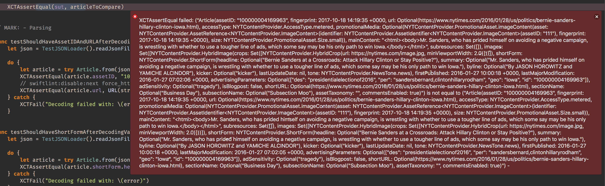
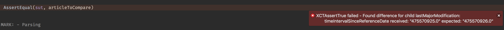

[](http://cocoapods.org/pods/Difference)
[](http://cocoapods.org/pods/Difference)
[](http://cocoapods.org/pods/Difference)

# Difference

Better way to identify what's different between 2 instances.

Have you ever written tests? 
Usually they use equality asserts, e.g. `XCTAssertEqual`, what happens if the objects aren't equal? Xcode throws a wall of text at you:



This forces you to manually scan the text and try to figure out exactly what's wrong, what if instead you could just learn which property is different?



## Installation

### CocoaPods

Add `pod 'Difference'` to your Podfile.

### Carthage

Add `github "krzysztofzablocki/Difference"` to your Cartfile.

### SwiftPM

Add `.package(name: "Difference", url: "https://github.com/krzysztofzablocki/Difference.git", .branch("master")),` dependency in your Package manifest.

## Using lldb

Write the following to see the difference between 2 instances:

`po dumpDiff(expected, received)`


## Integrate with XCTest
Add this to your test target:

```swift
public func XCTAssertEqual<T: Equatable>(_ expected: @autoclosure () throws -> T, _ received: @autoclosure () throws -> T, file: StaticString = #filePath, line: UInt = #line) {
    do {
        let expected = try expected()
        let received = try received()
        XCTAssertTrue(expected == received, "Found difference for \n" + diff(expected, received).joined(separator: ", "), file: file, line: line)
    }
    catch {
        XCTFail("Caught error while testing: \(error)", file: file, line: line)
    }
}
```

Replace `#filePath` with `#file` if you're using Xcode 11 or earlier.

## Integrate with Quick
Add this to your test target:

```swift
public func equalDiff<T: Equatable>(_ expectedValue: T?) -> Predicate<T> {
    return Predicate.define { actualExpression in
        let receivedValue = try actualExpression.evaluate()

        if receivedValue == nil {
            var message = ExpectationMessage.fail("")
            if let expectedValue = expectedValue {
                message = ExpectationMessage.expectedCustomValueTo("equal <\(expectedValue)>", "nil")
            }
            return PredicateResult(status: .fail, message: message)
        }
        if expectedValue == nil {
            return PredicateResult(status: .fail, message: ExpectationMessage.fail("").appendedBeNilHint())
        }

        return PredicateResult(bool: receivedValue == expectedValue, message: ExpectationMessage.fail("Found difference for " + diff(expectedValue, receivedValue).joined(separator: ", ")))
    }
}
```

## Integrate with The Composable Architecture

If you are using The Composable Architecture `nameLabels` configuration to get a diff that's more appropiate for reducer instrumentation

```swift
diff(oldState, newState, indentationType: .pipe, nameLabels: .comparing)
```

You can use this function in your own variant of [ReducerInstrumentation code based on this](https://github.com/pointfreeco/swift-composable-architecture/blob/e7dda73c35f1016c8ba82fd2b7c43757cce68e58/Sources/ComposableArchitecture/Debugging/ReducerDebugging.swift)

That way your diffs will look more like this:

```swift
Received action:
  AppAction.home(.howTo(.setSelectedSlide))
State:
home:
|	selectedHowTo:
|	|	selectedSlide:
|	|	|	Current: 8mnkni91h4fe
|	|	|	Previous: exei4wpqsmdk
```


